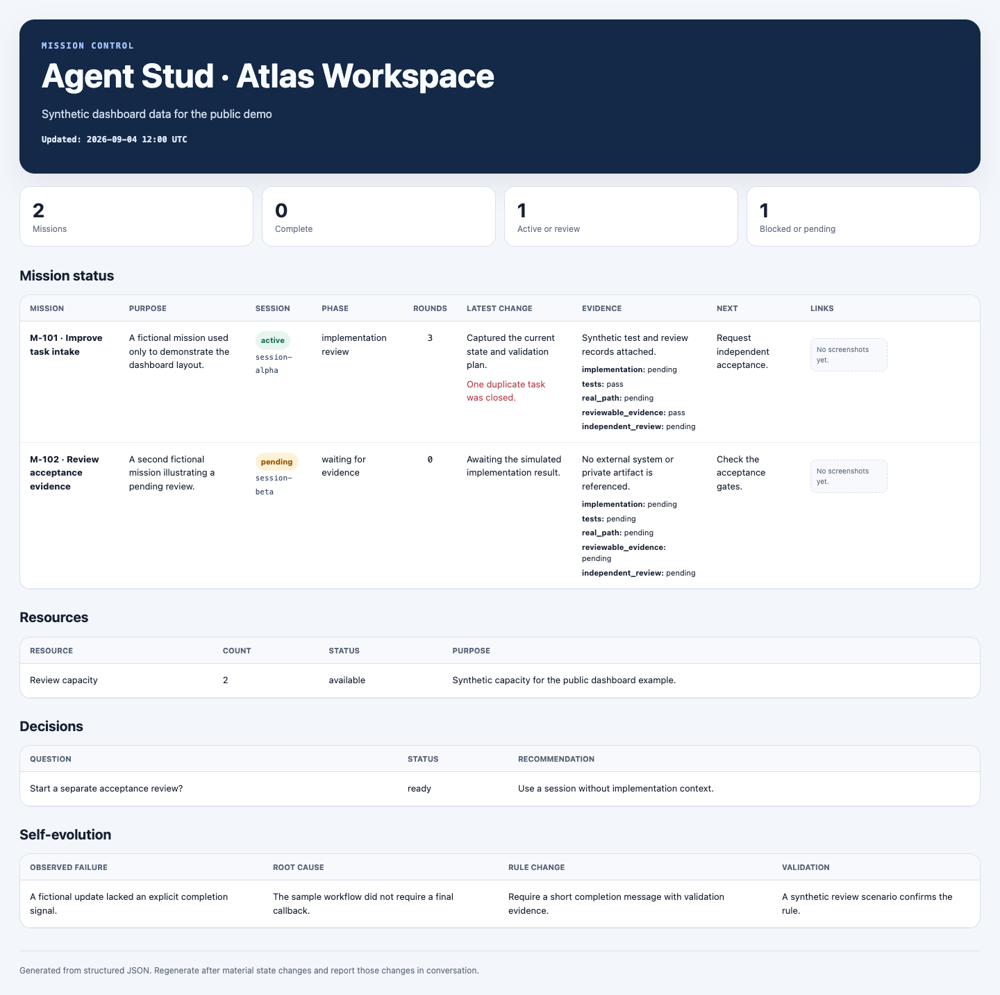

# Agent Stud

**Agent Stud 是给多 Agent 工程团队用的项目管家。** 当一个仓库里同时跑着多条 Mission、多个 Codex Session 和多轮评审时，它负责把分散的工作重新组织成可追踪、可验收、可进化的项目控制面。

## 解决什么问题

Agent 项目很容易出现这些问题：同一需求被多个 Session 重复做；一个 Session 表面完成但没有跑真实链路；关键反馈没派回拥有上下文的原任务；任务标题、证据和下一步散落在长对话里；一个仓库积累的好做法也无法安全地复用到下一个仓库。

Agent Stud 把这些问题变成一套明确的工作机制：先盘点和去重，再按 Mission 派单；优先把问题派回原 Session；等待事件、定时巡检和终态回传；以测试、真实路径和独立复核作为验收门；最后把已经验证的改进沉淀为可复用的管家能力。

## 包含什么

- `project-steward`：仓库管家。协调单个仓库里的 Mission、Session、资源申请、回传和验收。
- `portfolio-steward`：大总管。把 `project-steward` 完整复制到新仓库，记录复制血缘和本地定制，并汇总子管家的可复用进化候选。

对外叫 **Agent Stud**；为兼容已有安装和调用方式，核心 Skill 的技术标识仍是 `project-steward`。

`project-steward` 保留 Codex 多任务协作机制，包括语义化标题、原 Session 优先、`wait_threads` 事件等待、heartbeat 巡检、`send_message_to_thread` 终态回传、上下文衰竭交接、独立复核和主动汇报。

大总管直接督办跨仓库 Session 时也使用同一套运行协议。权威正文仍在 `project-steward/SKILL.md`；仓库通过确定性脚本生成 `portfolio-steward` 内部的自包含副本，避免安装后依赖跨目录引用：

```bash
python3 scripts/sync_runtime_protocol.py
python3 scripts/sync_runtime_protocol.py --check
```

修改仓库管家运行协议后必须重新生成；CI 会在投影过期时失败。该同步只负责两级管家的运行协议，不等于把母版升级自动应用到子仓库。

## Core 与仓库规则

派生一个仓库管家时，Agent Stud 仍会先复制完整 Skill；但它把规则分为两个归属明确的层：

- **Core**：Skill 本体和非 `local` reference，是可审查、可升级的跨仓库协作机制。
- **Local**：`references/local/`，由该业务仓库 always-owned。这里存放架构、测试、发布、隐私和团队约定；上游更新永远不会覆盖它。

管家每次自进化先判断归属：依赖当前仓库事实的规则直接进入 local；跨仓库成立且已脱敏、经验证的规则才交给大总管审查为 upstream candidate。这样不需要定期手工同步母版，也不会把一个仓库的私有约束误写成全局规则。

## Dashboard

下面是由合成数据生成的公开示例；其中没有真实仓库、任务、会话或内部链接。



项目看板由结构化 JSON 生成，不手工维护整份 HTML：

```bash
python3 skills/project-steward/scripts/render_dashboard.py \
  skills/project-steward/examples/dashboard-state.example.json \
  /tmp/agent-stud-dashboard.html
```

输出是零依赖的单文件 HTML，可直接在浏览器打开。输入字段见 `skills/project-steward/references/dashboard-schema.md`。

## 安装

克隆仓库后，将所需 Skill 目录复制或软链到你的 Agent Skill 目录。不同客户端的 Skill 根目录不同，请以客户端文档为准。

```bash
git clone https://github.com/gemma1044/agent-project-steward.git
ln -s "$PWD/agent-project-steward/skills/project-steward" ~/.codex/skills/project-steward
```

## 验证

```bash
python3 -m unittest discover -s tests -v
python3 scripts/check_public_release.py .
python3 scripts/check_public_release.py . --deny private-project --deny private-domain.example
```

把私有 Skill 改成公开版时必须采用“复制原文 → 逐节保留/泛化/删除 → 能力对账”的方式，禁止从零摘要重写。流程见 [CONTRIBUTING.md](CONTRIBUTING.md)。

## English

Agent Stud is a project steward for multi-agent engineering work. It coordinates missions and Codex sessions, checks evidence and acceptance gates, and lets a portfolio steward safely carry proven improvements from child repositories back to the canonical template.

## License

MIT
